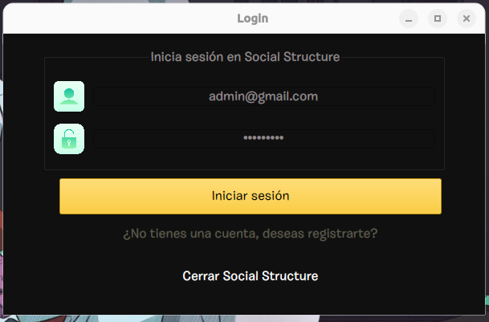
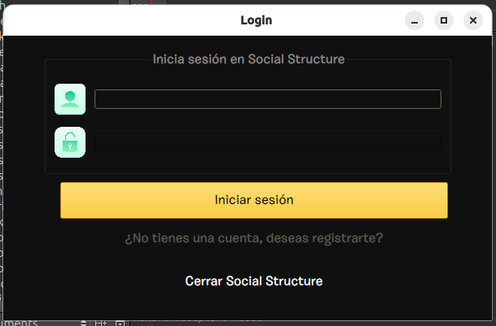
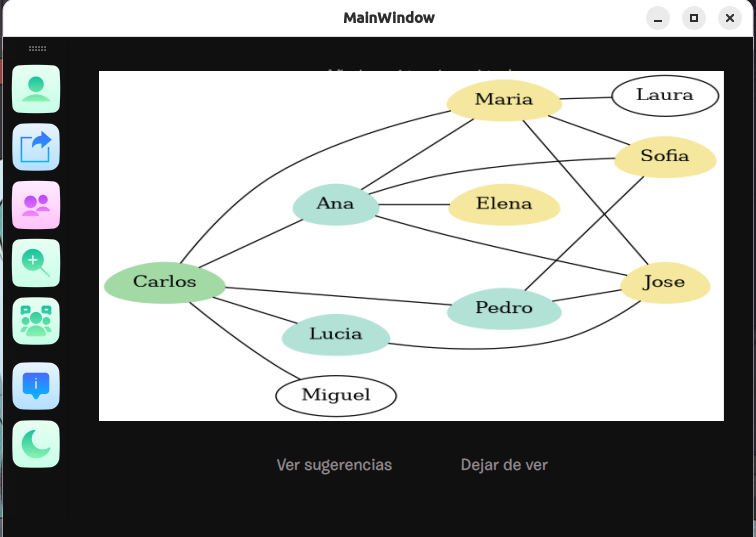
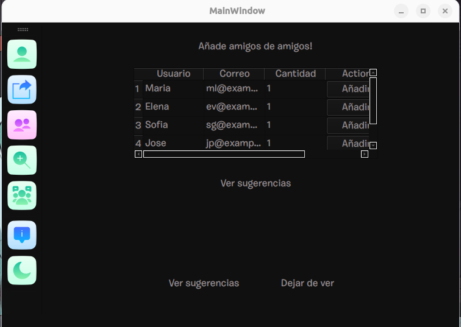

# Manual de Usuario - Proyecto Social Structure

## Universidad San Carlos de Guatemala  
**Facultad de Ingeniería, Escuela de Ciencias y Sistemas**  
**Curso: Estructuras de Datos**  
**Proyecto Fase 3: Social Structure**  
**Fecha de entrega: 26 de octubre, 23:59 horas**

---

### Índice
1. [Descripción del Proyecto](#descripción-del-proyecto)
2. [Inicio de Sesión](#inicio-de-sesión)
3. [Perfil de Usuario](#perfil-de-usuario)
4. [Relaciones de Amistad](#relaciones-de-amistad)
5. [Sugerencias de Amistad](#sugerencias-de-amistad)
6. [Gestión de Seguridad](#gestión-de-seguridad)
7. [Compresión y Descompresión de Datos](#compresión-y-descompresión-de-datos)
8. [Reportes](#reportes)

---

### 1. Descripción del Proyecto

La plataforma **Social Structure** es una red social desarrollada en C++ para la gestión y visualización de relaciones de amistad. Las funcionalidades implementadas en esta fase incluyen:
- **Grafo de Amistad:** Representado por una lista de adyacencia.
- **Sugerencias de Amistad:** Recomendaciones basadas en amigos comunes.
- **Compresión de Datos:** Uso del algoritmo de Huffman para compresión.
- **Blockchain y Árbol de Merkle:** Implementados para la seguridad de datos y la integridad de la información de publicaciones.

---

### 2. Inicio de Sesión

1. **Administrador**  
   El nombre de usuario y contraseña por defecto para el administrador es:
   - **Usuario:** `admin@gmail.com`
   - **Contraseña:** `EDD2S2024`

   

2. **Usuario Estándar**  
   Los usuarios estándar podrán acceder con las credenciales creadas durante su registro.

---

### 3. Perfil de Usuario

Cada usuario tiene acceso a su **perfil personal**, desde donde puede:
- Modificar **nombre**, **apellido**, **fecha de nacimiento**, y **contraseña**.
- Ver sus amigos y las recomendaciones de amistad.
  

---

### 4. Relaciones de Amistad

La aplicación utiliza un **grafo no dirigido** en una lista de adyacencia para representar amistades, optimizando la escalabilidad de la red.  
Para cada usuario:
- Puede ver una representación gráfica de sus amigos.
- Visualizar las conexiones directas e indirectas (amigos de amigos).

**Acceso a Relaciones:**
- Desde la sección de relaciones, seleccione "Ver Amigos" para obtener el grafo.

---

### 5. Sugerencias de Amistad

Las sugerencias se basan en **amigos en común** y la **distancia de dos saltos**. El sistema calcula y prioriza las recomendaciones mostrando primero los usuarios con más amigos comunes.

1. **Acceso a Sugerencias de Amistad:**
   - Seleccione "Sugerencias de Amigos" en el menú.
   - Las recomendaciones se muestran en orden de relevancia.

---

### 7. Compresión y Descompresión de Datos

**Compresión:** Los datos de los usuarios, amigos y solicitudes se comprimen mediante el algoritmo de **Huffman** al cerrar sesión, guardándose con extensión `.edd`.  
**Descompresión:** Al abrir sesión, los datos son descomprimidos y cargados nuevamente para su uso.

---

### 8. Reportes

El sistema genera varios **reportes gráficos** para el administrador y el usuario, usando Graphviz para visualizar relaciones y estructuras de seguridad.

1. **Usuario:**
   - Visualización de **sugerencias de amistad**.
   - **Grafo de amistad y sugerencias** de amistad diferenciados por color.

2. **Administrador:**
   - **Lista de adyacencia de amistades**
   - **Grafo completo de relaciones de amistad**
   - **Blockchain**
   - **Árbol de Merkle**

---

### Observaciones
- **Sistema Operativo:** Ubuntu Linux
- **IDE:** Qt Creator, MinGW x64 (versión 6.8.0)
- **Herramientas:** Uso de Graphviz para graficar estructuras y visualización.

**Nota:** Responda preguntas sobre la funcionalidad y arquitectura del sistema durante la evaluación.

---
